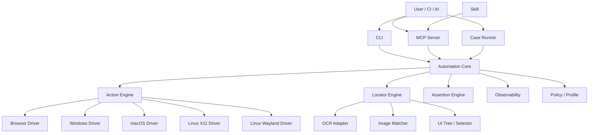

# 通用跨平台自动化测试平台设计稿

## 1. 文档目标

本文档定义一个面向 `Windows`、`macOS`、`Linux` 的通用自动化测试平台设计，用于对自有网站、桌面软件和系统级交互流程进行自动化测试。平台需要同时支持：

- 通过桌面窗口执行点击、拖拽、输入、滚动、截图、等待、断言等操作
- 优先通过浏览器/控件能力执行高稳定度自动化，必要时回退到桌面级图像/OCR/坐标自动化
- 通过 `CLI`、`MCP`、`Skill` 暴露能力，供 AI 或工程系统调用
- 支持系统级测试模式，包括敏感窗口、系统设置页、安装器、权限相关界面等
- 具备可审计、可回放、可扩展、可跨平台适配的工程结构

## 2. 背景与问题

现有自动化测试通常分裂为几类：

- 网页自动化：依赖 DOM/浏览器协议，稳定但无法覆盖桌面应用和系统弹窗
- 桌面自动化：依赖窗口树、坐标、图像匹配，覆盖广但稳定性不均
- AI 调用：缺少统一工具层，导致能力难以被 AI 稳定调用

目标平台需要把这些方式统一到一个执行内核中，对外呈现一致的动作接口和执行结果。

## 3. 目标与非目标

### 3.1 目标

- 建立统一动作模型：`attach`、`locate`、`click`、`drag`、`type`、`wait`、`assert`
- 支持多定位策略：控件树、浏览器选择器、图像锚点、OCR 文本、相对坐标
- 支持多运行入口：本地 CLI、MCP Server、测试用例 Runner、未来录制器
- 支持系统级测试模式，允许默认进入实验室/隔离环境的高权限策略
- 统一日志、截图、录像、失败报告、回放信息
- 允许 AI 通过 MCP 或 Skill 调用平台能力

### 3.2 非目标

- 不以绕过第三方验证码或对抗反自动化机制为目标
- 不承诺在所有 Linux Wayland 组合上首版完全等价
- 不把录制器、智能修复器、分布式调度器作为首版必需范围

## 4. 典型使用场景

### 4.1 网站测试

- 通过 Playwright 控制浏览器完成登录、表单、支付前流程、页面断言
- 当网页包含原生文件选择器、浏览器权限弹窗、系统文件窗口时，切换到桌面自动化驱动

### 4.2 桌面软件测试

- 启动和附着桌面应用
- 查找窗口、控件、文本、图像元素
- 点击按钮、输入文本、拖动滑块、校验界面变化

### 4.3 系统级测试

- 安装器测试
- 系统设置页测试
- 权限授予流程测试
- 文件选择器、打印对话框、系统通知交互测试

### 4.4 AI 调用场景

- AI 通过 MCP 调用平台动作完成一步一步的可观测测试
- AI 通过 Skill 学会如何优先选择稳定定位方式和如何处理失败重试

## 5. 总体设计原则

1. 统一抽象，平台差异下沉到驱动层
2. 定位优先级固定：结构化定位 > 图像定位 > OCR > 坐标
3. 动作与定位解耦，方便替换定位策略
4. 所有动作都有结构化返回值和证据产出
5. 高权限能力可默认在实验环境开启，但必须有环境边界和审计
6. CLI、MCP、Skill 共用同一核心，不重复实现

## 6. 总体架构



## 7. 分层设计

### 7.1 Core 层

负责统一的领域模型和执行逻辑：

- 会话管理
- 目标窗口管理
- 动作调度
- 超时/重试
- 结构化结果
- 执行证据收集
- 错误分类
- 配置与策略装载

### 7.2 Driver 层

负责平台差异和底层交互：

- `browser`：浏览器协议、DOM、页面截图、元素操作
- `windows`：窗口句柄、UIA、输入注入、屏幕坐标映射
- `macos`：AX 树、Quartz 事件、权限检查
- `linux_x11`：窗口系统、AT-SPI、X11 输入
- `linux_wayland`：Portal/compositor 特定实现

### 7.3 Adapter 层

对外暴露统一接口：

- `cli`
- `mcp-server`
- `runner`
- 后续 `recorder`

### 7.4 Skill 层

定义 AI 调用策略，不承载执行实现：

- 何时调用平台
- 优先定位策略
- 如何截图确认
- 如何处理失败
- 如何组织报告

## 8. 核心领域模型

### 8.1 Session

表示一次完整自动化执行会话。

字段建议：

- `session_id`
- `profile`
- `operator`
- `started_at`
- `target_platform`
- `artifacts_dir`
- `allow_sensitive_windows`
- `allow_destructive_actions`

### 8.2 Target

表示动作作用对象。

类型建议：

- `window`
- `browser_page`
- `element`
- `image_anchor`
- `ocr_text`
- `coordinate`

### 8.3 Action

统一动作模型：

- `attach_window`
- `activate_window`
- `click`
- `double_click`
- `right_click`
- `drag`
- `scroll`
- `type_text`
- `press_key`
- `hotkey`
- `wait_for`
- `assert_text`
- `assert_image`
- `screenshot`
- `run_case`

### 8.4 Result

所有动作统一返回：

- `ok`
- `code`
- `message`
- `data`
- `artifacts`
- `timing_ms`
- `retry_count`

### 8.5 Artifact

证据对象：

- `screenshot`
- `window_snapshot`
- `page_html`
- `ocr_dump`
- `match_debug_image`
- `trace`
- `video`
- `log`

## 9. 定位系统设计

### 9.1 定位优先级

平台默认按照以下优先级执行定位：

1. 浏览器选择器或页面对象
2. 原生控件树或辅助功能树
3. 图像模板匹配
4. OCR 文本匹配
5. 相对窗口坐标

### 9.2 定位器接口

```python
class Locator(Protocol):
    def locate(self, context: ActionContext, target: TargetSpec) -> LocateResult:
        ...
```

### 9.3 支持的定位类型

- `selector`
- `role`
- `name`
- `automation_id`
- `xpath`
- `image`
- `text`
- `relative_point`

### 9.4 图像定位

能力要求：

- 支持模板匹配阈值配置
- 支持多尺度缩放和 DPI 校正
- 输出候选框及置信度
- 失败时生成 debug 截图

### 9.5 OCR 定位

能力要求：

- 对指定窗口或区域截图 OCR
- 输出识别文本、置信度、文字框
- 支持模糊匹配、正则匹配、大小写控制

## 10. 动作系统设计

### 10.1 通用动作

- `attach_window`
- `list_windows`
- `focus_window`
- `capture_window`
- `click`
- `move`
- `drag`
- `scroll`
- `type_text`
- `clear_text`
- `press_key`
- `hotkey`
- `wait_for_window`
- `wait_for_target`
- `assert_exists`
- `assert_text`
- `assert_image`

### 10.2 动作执行流程

每个动作建议采用以下流水线：

1. 校验会话状态
2. 校验策略权限
3. 解析目标对象
4. 执行定位
5. 执行动作
6. 采集证据
7. 生成结果

### 10.3 拖拽动作

拖拽应支持：

- 线性路径
- 分段路径
- 固定速度/时长
- 控制起点/终点偏移
- 失败重试

建议输入模型：

```json
{
  "window_id": "win-001",
  "from": { "type": "image", "value": "assets/slider.png" },
  "to": { "type": "relative_point", "x": 420, "y": 180 },
  "duration_ms": 600,
  "steps": 24
}
```

## 11. 断言与等待系统

### 11.1 等待

统一等待类型：

- 等待窗口出现
- 等待窗口激活
- 等待目标元素出现
- 等待文本出现/消失
- 等待图像出现/消失
- 等待区域变化稳定

### 11.2 断言

断言种类：

- `exists`
- `not_exists`
- `text_equals`
- `text_contains`
- `image_match`
- `window_title_contains`
- `process_running`

### 11.3 稳定性策略

- 默认超时可配置
- 默认重试次数可配置
- 对易抖动目标支持轮询去抖
- 对 OCR/图像断言保存调试证据

## 12. 浏览器自动化设计

### 12.1 浏览器驱动定位

浏览器场景优先使用：

- `Playwright` 页面操作
- DOM 选择器
- Role 选择器
- Frame 定位
- 网络拦截

### 12.2 浏览器与桌面自动化协同

执行器应支持在同一用例中混合调用：

1. 浏览器导航和 DOM 操作
2. 系统文件选择器的桌面操作
3. 浏览器权限弹窗的桌面操作
4. 返回页面继续断言

### 12.3 页面对象模式

对高频业务页面建议支持页面对象封装，但核心平台不强绑定业务模型。

## 13. 平台驱动设计

### 13.1 Windows Driver

职责：

- 枚举窗口
- 通过句柄附着窗口
- 读取窗口区域
- UIA 控件树查询
- 注入鼠标键盘事件
- 处理 DPI 缩放、多显示器坐标

建议模块：

- `window_manager.py`
- `uia_locator.py`
- `input_injector.py`
- `screen_capture.py`

### 13.2 macOS Driver

职责：

- 基于 AX 树获取窗口和控件
- 基于 Quartz 进行输入注入
- 检查 Accessibility / Automation 权限
- 处理 Retina 缩放

建议模块：

- `ax_locator.py`
- `quartz_input.py`
- `permission_probe.py`

### 13.3 Linux X11 Driver

职责：

- X11 窗口枚举与定位
- AT-SPI 查询控件信息
- X11 输入注入
- 多桌面环境适配

### 13.4 Linux Wayland Driver

职责：

- 单独实现兼容层
- 区分不同 compositor 能力
- 提供能力探测结果
- 对不支持的动作返回明确错误码

### 13.5 Browser Driver

职责：

- 浏览器启动与附着
- Page/Context 生命周期管理
- 元素定位与页面截图
- 与桌面驱动联动

## 14. 高权限与系统级测试策略

### 14.1 策略目标

由于本平台明确服务于系统级测试场景，需要支持默认允许敏感窗口的运行模式，但必须限制在专用测试环境中。

### 14.2 建议的配置档案

- `standard`
- `lab_default`
- `privileged_lab`

说明：

- `standard`：普通应用测试
- `lab_default`：测试机默认档案，可允许系统设置、安装器、文件对话框
- `privileged_lab`：高权限实验环境，允许全部系统级目标

### 14.3 档案字段

```yaml
profile: privileged_lab
allow_sensitive_windows: true
allow_system_settings: true
allow_security_prompts: true
allow_credential_fields: true
allow_process_launch: true
allow_process_kill: true
allow_destructive_actions: true
require_audit_log: true
require_video_recording: true
require_pre_action_screenshot: true
default_retry: 2
```

### 14.4 环境边界建议

虽然允许默认高权限，仍建议限制在以下环境：

- 专用测试机
- 虚拟机
- 独立测试账号
- 独立测试网络
- 测试环境配置中心

### 14.5 审计要求

对高权限档案，必须记录：

- 谁发起
- 何时执行
- 执行了什么动作
- 操作前后截图
- 对应窗口和进程信息
- 成败结果

## 15. 用例 DSL 设计

### 15.1 目标

支持非编程测试人员和 AI 生成结构化测试步骤。

### 15.2 YAML 示例

```yaml
name: install-and-login
profile: privileged_lab
artifacts: ./artifacts/install-and-login

steps:
  - action: launch_process
    path: C:\\Apps\\Setup.exe

  - action: attach_window
    title: Setup Wizard
    timeout_ms: 15000

  - action: click
    target:
      type: text
      value: Next

  - action: wait_for
    target:
      type: text
      value: Finish
    timeout_ms: 60000

  - action: click
    target:
      type: text
      value: Finish

  - action: launch_browser
    browser: chromium
    url: https://test.example.com/login

  - action: type_text
    target:
      type: selector
      value: "#username"
    text: tester

  - action: type_text
    target:
      type: selector
      value: "#password"
    text: secret

  - action: click
    target:
      type: selector
      value: "button[type=submit]"

  - action: assert_text
    target:
      type: text
      value: Dashboard
```

### 15.3 DSL 设计要求

- 人类可读
- AI 易生成
- 可映射到统一动作接口
- 支持条件、重试、超时、变量、截图策略

## 16. CLI 设计

### 16.1 设计目标

CLI 是调试入口、脚本入口和 MCP 复用入口。

### 16.2 命令建议

```text
simctl session start --profile privileged_lab
simctl window list --json
simctl window attach --title "Google Chrome"
simctl action click --window win-001 --x 320 --y 200
simctl action drag --window win-001 --x1 100 --y1 200 --x2 500 --y2 200
simctl action type --window win-001 --text "hello"
simctl action screenshot --window win-001 --out artifacts/shot.png
simctl case run tests/login.yaml
```

### 16.3 输出格式

默认输出结构化 JSON：

```json
{
  "ok": true,
  "code": "OK",
  "data": {
    "window_id": "win-001"
  }
}
```

## 17. MCP 设计

### 17.1 目标

让 AI 以工具调用的方式安全、稳定地使用平台能力。

### 17.2 工具分组

#### 会话工具

- `start_session`
- `end_session`
- `get_session`

#### 窗口工具

- `list_windows`
- `attach_window`
- `focus_window`
- `capture_window`

#### 动作工具

- `click`
- `double_click`
- `drag`
- `scroll`
- `type_text`
- `press_key`
- `hotkey`

#### 定位工具

- `find_image`
- `find_text`
- `find_element`

#### 测试工具

- `run_case`
- `assert_text`
- `assert_image`

### 17.3 MCP 返回约定

返回统一结构：

- `ok`
- `message`
- `data`
- `artifacts`

### 17.4 MCP 工具示例

```json
{
  "name": "click",
  "input": {
    "session_id": "sess-001",
    "window_id": "win-001",
    "target": {
      "type": "text",
      "value": "Install"
    }
  }
}
```

## 18. Skill 设计

### 18.1 目标

Skill 用于指导 AI 正确使用平台，而不是直接实现平台功能。

### 18.2 Skill 内容建议

Skill 应包含：

- 何时使用本平台
- 如何选择定位方式
- 何时使用浏览器驱动，何时使用桌面驱动
- 失败处理策略
- 结果报告格式

### 18.3 Skill 调用规范建议

AI 使用流程：

1. 启动或检查会话
2. 确认目标窗口或页面
3. 优先使用结构化定位
4. 失败时回退图像/OCR
5. 每个关键步骤产出截图
6. 输出最终报告

## 19. 可观测性设计

### 19.1 日志

日志层次：

- `session log`
- `step log`
- `driver log`
- `locator debug log`

### 19.2 截图

支持：

- 全屏截图
- 窗口截图
- 区域截图
- 操作前截图
- 操作后截图

### 19.3 视频

对高权限或长流程测试，支持会话录像。

### 19.4 报告

建议输出：

- `report.json`
- `report.html`
- `artifacts/`

## 20. 错误模型设计

### 20.1 错误码

建议错误分类：

- `WINDOW_NOT_FOUND`
- `TARGET_NOT_FOUND`
- `ACTION_TIMEOUT`
- `PERMISSION_DENIED`
- `DRIVER_NOT_AVAILABLE`
- `UNSUPPORTED_ON_PLATFORM`
- `INVALID_TARGET`
- `POLICY_BLOCKED`

### 20.2 错误上下文

错误对象应携带：

- 失败动作
- 当前平台
- 当前窗口
- 目标描述
- 已尝试定位方式
- 调试截图

## 21. 配置设计

### 21.1 全局配置

```yaml
default_profile: lab_default
artifacts_root: ./artifacts
default_timeout_ms: 10000
default_retry: 2
ocr_engine: paddleocr
image_match_threshold: 0.88
```

### 21.2 平台配置

```yaml
platforms:
  windows:
    dpi_awareness: true
  macos:
    require_accessibility: true
  linux:
    prefer: x11
```

## 22. 插件与扩展设计

### 22.1 扩展点

- 自定义驱动
- 自定义定位器
- 自定义断言器
- 自定义报告器
- 自定义策略提供器

### 22.2 插件接口

```python
class DriverPlugin(Protocol):
    name: str
    def probe(self) -> ProbeResult: ...
    def create(self, config: dict) -> PlatformDriver: ...
```

## 23. 目录结构建议

```text
SimulateInput/
├─ pyproject.toml
├─ README.md
├─ docs/
│  └─ automation-platform-design.md
├─ src/
│  └─ simulateinput/
│     ├─ core/
│     │  ├─ session.py
│     │  ├─ models.py
│     │  ├─ engine.py
│     │  ├─ policy.py
│     │  └─ errors.py
│     ├─ actions/
│     │  ├─ click.py
│     │  ├─ drag.py
│     │  ├─ type_text.py
│     │  └─ wait_for.py
│     ├─ locators/
│     │  ├─ selector.py
│     │  ├─ uia.py
│     │  ├─ image.py
│     │  └─ ocr.py
│     ├─ drivers/
│     │  ├─ browser/
│     │  ├─ windows/
│     │  ├─ macos/
│     │  ├─ linux_x11/
│     │  └─ linux_wayland/
│     ├─ mcp/
│     │  └─ server.py
│     ├─ cli/
│     │  └─ main.py
│     ├─ runner/
│     │  └─ case_runner.py
│     └─ reporting/
│        ├─ logger.py
│        ├─ screenshots.py
│        └─ report_builder.py
├─ tests/
│  ├─ unit/
│  ├─ integration/
│  └─ e2e/
└─ skills/
   └─ simulateinput/
      └─ SKILL.md
```

## 24. 技术选型建议

### 24.1 语言

首选 `Python`，原因：

- 跨平台自动化生态成熟
- AI、CLI、MCP 集成成本低
- OCR、图像处理、测试框架丰富

### 24.2 候选库

- 浏览器：`playwright`
- 图像：`opencv-python`
- 截图：`mss`
- OCR：`paddleocr` 或 `pytesseract`
- 配置/DSL：`pydantic`、`PyYAML`
- CLI：`typer`
- 测试：`pytest`

### 24.3 平台库

- Windows：`pywin32`、`pywinauto`
- macOS：`pyobjc`
- Linux：`python-xlib`、AT-SPI 相关绑定

## 25. 开发阶段规划

### 阶段 1：MVP

- Session
- Window attach/list
- Screenshot
- Click/drag/type
- YAML case runner
- CLI

### 阶段 2：AI 接入

- MCP server
- Skill 初稿
- 统一 JSON 输出
- 工具调用日志

### 阶段 3：稳定性增强

- Image locator
- OCR locator
- Retry/wait strategy
- HTML/JSON report

### 阶段 4：跨平台深化

- macOS driver
- Linux X11 driver
- Wayland compatibility layer

### 阶段 5：高级能力

- Recorder
- Playback editor
- 智能定位修复
- 分布式执行

## 26. 验收标准

首版建议达到以下标准：

- 在 Windows 上可稳定执行附着、点击、输入、拖拽、截图
- 可运行 YAML 用例
- 可通过 CLI 调用全部 MVP 能力
- 可通过 MCP 暴露核心工具
- Skill 可指导 AI 完成窗口附着、定位、执行、报告
- 具备高权限测试档案、日志、截图、录像能力

## 27. 推荐下一步

1. 先把本设计拆成 `MVP 范围` 与 `后续范围`
2. 基于目录结构创建 Python 工程骨架
3. 优先实现 `Session + CLI + Windows Driver`
4. 再补 `MCP Server` 和 `SKILL.md`

